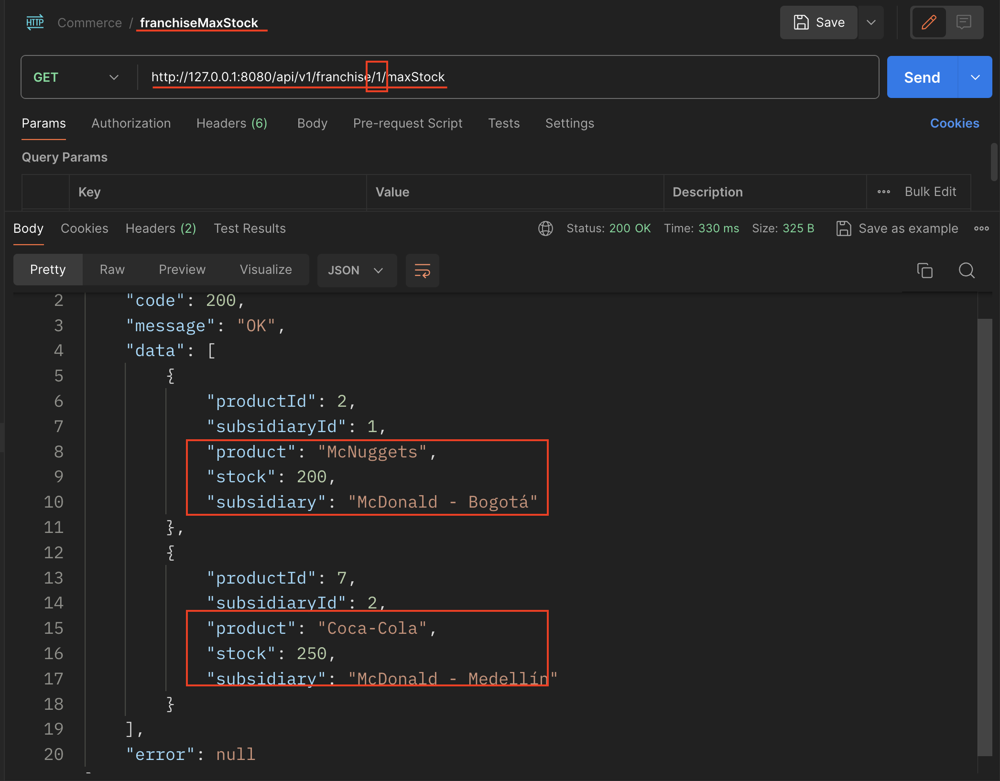

# Franchises
Technical Test NEQUI - 2024 Franchises

# Arquitectura

Este proyecto está creado siguiendo los conceptos de la *Arquitectura de Puertos y Adaptadores*, que es un patrón de
arquitectura que busca desacoplar la lógica de negocio del entorno externo, facilitando la modularidad y la prueba unitaria.

- *aplicacion*: Contiene la lógica de aplicación que utiliza los puertos definidos.

- *dominio*:  Aquí se encuentra el núcleo de la aplicación.

- *adapter*: Implementa adaptadores que conectan los puertos del dominio con servicios externos. Estos adaptadores se
  encargan de la interacción con bases de datos, APIs, etc.


# Base de Datos

Este proyecto utiliza la base de datos relacional MySQL.

- Diagrama Entidad-Relación para la solución, DB: **commerce**


# Requisitos 

- Java 17
- Gradle 8 +
- Docker
- Docker-compose

# Instalación

1. Una vez instalados todos los requisitos, se debe compilar el proyecto para generar el JAR, que quedará en la ruta
   */build/libs/franchise-0.0.1.jar*. Ejecutar el siguiente comando en la raíz del proyecto:
   ```
   gradle clean build
   ```
   Salida:
   ```
   BUILD SUCCESSFUL in 2s
   8 actionable tasks: 8 executed
   ```
2. Cuando exista el JAR, debemos ejecutar el comando de Docker Compose, encargado de montar la base de datos MySQL
   y crear nuestra imagen del proyecto, para crear un ambiente en red donde se vea la aplicación con la base de datos. 
   Ejecutar el siguiente comando en la raíz del proyecto:
   ```
   docker-compose up -d
   ```
   Salida:
   ```
   [+] Running 2/2
   ⠿ Container franchises-db-1  Started                                                                                                                       0.4s
   ⠿ Container app-container    Started  
   ```
   Listo la aplicacion esta arriba.
   Observaciones: 
   ```
   docker ps -> para ver los contenedores
   docker-compose down -> para bajar el ambiente
   ```

# Prueba 

Para el caso de prueba, se precargó la información de dos franquicias, cuatro sucursales y dieciséis productos.
Se entrega la colección de Postman [Commerce](doc/Commerce.postman_collection.json).

- Evidencia para el criterio: Exponer un endpoint que permita mostrar cuál es el producto con más stock por
  sucursal para una franquicia puntual. Debe retornar un listado de productos que indique a qué sucursal pertenecen.
  

## Fin
